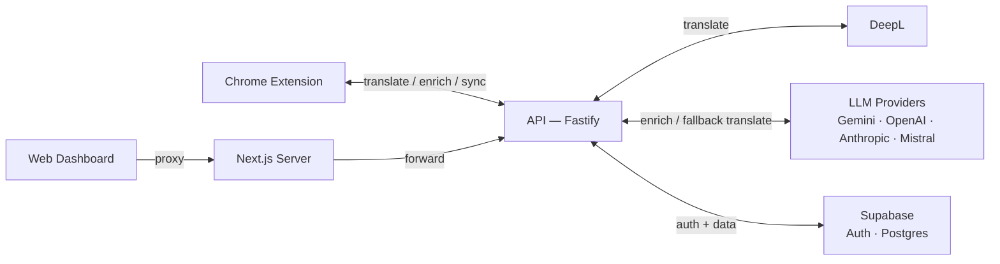

# Gato

A Chrome extension for learning languages in context. Translate text on any webpage with LLM-powered, context-aware translations — then build lasting vocabulary through enrichment data, saved concepts, and spaced repetition review.

## Try It

- **Chrome Web Store** — install the live extension: <https://chromewebstore.google.com/detail/gato-%E2%80%94-translate-learn-in/nbljhkoabjlchochcncpnjjbpfakdndd>
- **Web dashboard** — review vocabulary, track progress, manage settings: <https://gato.giupana.com>

## Architecture



## How It Works

**DeepL for translation, LLMs for enrichment.** Translations go through DeepL for speed and accuracy, with LLMs as a fallback for unsupported languages. Enrichment data (pronunciation, grammar, related words, usage examples) is always LLM-generated — it's what LLMs are genuinely good at.

**Context changes meaning.** When you select text, the extension captures the surrounding sentences and passes them to the translation and enrichment pipeline. "Bank" in a finance article translates differently than "bank" near a river — context disambiguation happens automatically.

**Adaptive enrichment.** A single word gets full enrichment (phonetic, grammar, related words). A short phrase gets grammar and related words. A full sentence just gets translated — no unnecessary overhead.

**Personal context shapes results.** Users can set context like "I'm a medical student learning Portuguese." This is injected into enrichment prompts, so explanations and examples become relevant to the user's domain.

**Available in any language.** The entire UI is translatable into 30+ languages. Strings are translated via DeepL (with LLM fallback), cached in the database, and versioned — so updates propagate without redeploying the extension.

**Spaced repetition built in.** Saved concepts are reviewed using the SM-2 algorithm with automatic state transitions (learning → familiar → mastered). Failed items resurface in minutes, not days.

**Bring your own API key.** Ships with a free default (Gemini), but users can plug in their own OpenAI, Anthropic, Mistral, or Google key for a preferred provider.

## Features

- Multiple translation flows: in-page popup, context menu, sidepanel
- Per-site activation — enable on specific sites, works instantly without refresh
- Source language auto-detection
- Theme support (light/dark/system)
- Auth sync between extension and web dashboard

## Tech Stack

| App | Stack |
|-----|-------|
| `apps/extension` | React, TypeScript, WXT, Tailwind CSS, Radix UI |
| `apps/api` | Fastify, Drizzle ORM, PostgreSQL, Vercel AI SDK |
| `apps/web` | Next.js, Tailwind CSS, Radix UI |

**Infrastructure:** Supabase (auth + DB), Railway (API), Vercel (dashboard), Sentry (error tracking)

**LLM providers:** Google Gemini (default), OpenAI, Anthropic, Mistral — bring your own API key.

## Architecture Decisions

Design rationale is documented in [`apps/api/adr/`](apps/api/adr/).

## Development

```bash
pnpm install
pnpm dev          # Start all apps
```

### Extension

```bash
pnpm dev:extension
pnpm build:extension
```

Load `.output/chrome-mv3` as an unpacked extension in `chrome://extensions`.

### API

```bash
pnpm dev:api
```

Requires environment variables — see `apps/api/.env.default`.
